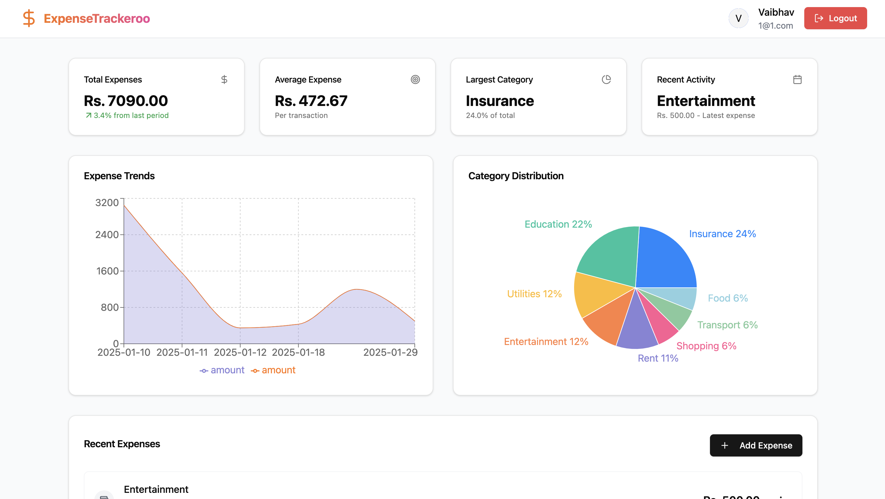

# ExpenseTrackeroo 💰

[](https://nodejs.org/)
[](https://reactjs.org/)

> A modern full-stack expense tracking application built with React and Node.js

<p align="center">
  
</p>

## ✨ Features

- 📊 **Real-time Dashboard** - Track expenses with interactive charts and graphs
- 💸 **Expense Management** - Add, edit, and delete expenses effortlessly
- 📱 **Responsive Design** - Works seamlessly on desktop and mobile devices
- 📈 **Visual Analytics** - Pie charts and trend analysis for better insights
- 🏷️ **Category Management** - Organize expenses by customizable categories

## 🚀 Quick Start

### Prerequisites

- Node.js (v14 or higher)
- npm or yarn
- MongoDB/PostgreSQL

### Installation

1️⃣ Clone the repository
```bash
git clone https://github.com/yourusername/expensetrackeroo.git
cd expensetrackeroo
```

2️⃣ Install backend dependencies
```bash
cd api
npm install
```

3️⃣ Install frontend dependencies
```bash
cd client
npm install
```

4️⃣ Set up environment variables
```bash
# Create .env file in backend directory
cp .env.example .env
```

5️⃣ Start the application
```bash
# Start backend (from backend directory)
npm start

# Start frontend (from frontend directory)
npm run dev
```

Visit `http://localhost:5173` to view the application

## 🛠️ Tech Stack

**Client:** 
- React
- Chart.js
- Tailwind CSS

**Server:** 
- Node.js
- Express
- MongoDB/PostgreSQL

## 📝 API Reference

#### Get all expenses

```http
GET /expenses
```

#### Add expense

```http
POST /expenses
```

| Parameter | Type     | Description                |
| :-------- | :------- | :------------------------- |
| `amount` | `number` | **Required**. Expense amount |
| `category` | `string` | **Required**. Expense category |
| `description` | `string` | Expense description |
| `date` | `date` | **Required**. Transaction date |

#### Update expense

```http
PUT /expenses/${id}
```

#### Delete expense

```http
DELETE /expenses/${id}
```

## 📊 Database Schema

```javascript
{
  id: ObjectId,
  amount: Number,
  category: String,
  description: String,
  date: Date,
  userId: ObjectId // Optional - for authentication
}
```

## 🔐 Environment Variables

To run this project, you will need to add the following environment variables to your .env file

`MONGODB_URI`

`JWT_SECRET`

`PORT`


## 🛣️ Roadmap

- [ ] User authentication
- [ ] Expenses at a glance
- [ ] Visual graphs and charts
- [ ] Edit, Add, Delete expenses
- [ ] Real time updates


